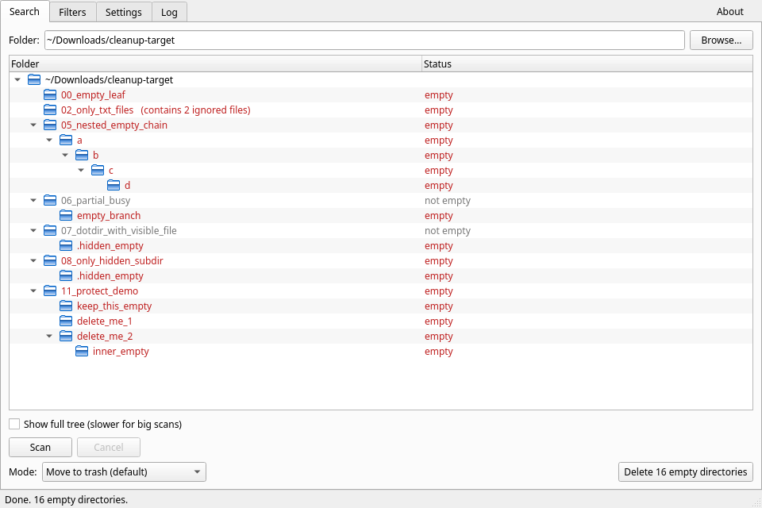
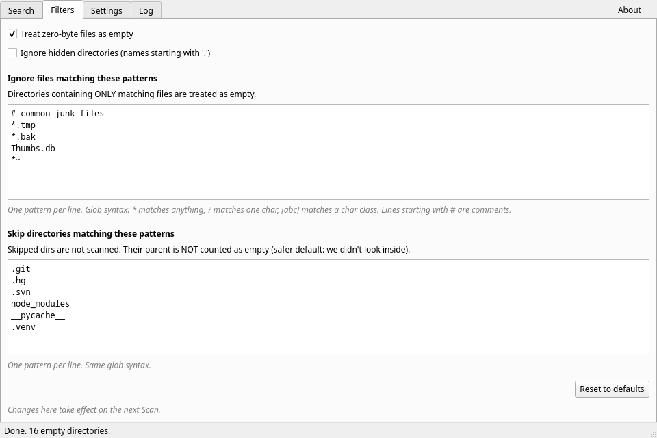

# redx

[](https://github.com/mescon/redx/actions/workflows/ci.yml)
[](https://www.gnu.org/licenses/lgpl-3.0)
[](https://www.python.org/)
[](https://github.com/mescon/redx/tags)

Find and delete empty directories on Linux.

A small desktop app that scans a folder, shows every empty subdirectory in a colour-coded tree, and lets you delete them safely (to trash by default). You can right-click to protect specific branches, and define rules for what counts as "empty" (for example, "directories containing only `*.txt` files").

This is a Linux port of the Windows app [RED (Remove-Empty-Directories)](https://github.com/hxseven/Remove-Empty-Directories), written in Python with PySide6 (Qt 6). Runs on KDE, GNOME, XFCE, Sway, and any other Linux desktop.

## Screenshots

Scan results: empty directories in red, mixed parents in gray, count of "ignored" or "empty" files annotated next to the folder name:



Filters: glob-style ignore patterns for files and directories, plus a "treat zero-byte files as empty" toggle:



## Install

### Arch, CachyOS, Manjaro, EndeavourOS, Garuda: via AUR

```bash
yay -S redx       # or paru -S redx, or any AUR helper
```

The package is at [aur.archlinux.org/packages/redx](https://aur.archlinux.org/packages/redx). It pulls the source at the latest tagged release, builds the wheel, runs the test suite during build, and installs system-wide via pacman.

### Any other Linux: from source

You need **Python 3.11 or newer**. No sudo, no system-wide pollution.

```bash
git clone https://github.com/mescon/redx.git
cd redx
./install.sh
```

That installs redx for your user only. When it finishes, open your application menu and search for **redx**. Click the icon to launch.

To uninstall:

```bash
./uninstall.sh
```

#### Where things go (source install)

| Path                                                    | What                                |
|---------------------------------------------------------|-------------------------------------|
| `~/.local/share/redx/venv/`                             | Private Python venv with the app    |
| `~/.local/bin/redx`                                     | Optional terminal launcher         |
| `~/.local/share/applications/redx.desktop`              | App menu entry                     |
| `~/.local/share/icons/hicolor/scalable/apps/redx.svg`   | Icon                               |
| `~/.local/share/pixmaps/redx.svg`                       | Icon fallback (broader shell support) |
| `~/.config/redx/redx.conf`                              | Settings (created on first close)  |

## Use

1. Click **Browse** and pick a folder. (You can also drag a folder onto the window from your file manager.)
2. Click **Scan**. Empty directories show up in red.
3. *(Optional)* Open the **Filters** tab and add patterns. For example, `*.tmp` on its own line means "directories containing only .tmp files count as empty".
4. *(Optional)* Right-click any folder in the tree, choose **Protect**, to keep it. Protected folders turn blue. Right-click again to **Unprotect**.
5. Pick a delete mode (default is **Move to trash**, which is reversible) and click the big **Delete** button.

The **Log** tab keeps a running record of every action with timestamps.

## Delete modes

| Mode                           | What it does                                           |
|--------------------------------|--------------------------------------------------------|
| Move to trash *(default)*      | Sends folders to your desktop trash. Recoverable.      |
| Delete permanently             | Bypasses trash. Faster, but unrecoverable.             |
| Simulate                       | Pretends to delete. Nothing changes. Use to preview.   |

## Try it on the test sandbox

The repo includes a small generated tree with 12 example cases:

```bash
python scripts/build_sandbox.py
```

Then in the GUI: **Browse** > pick `tests/sandbox` > **Scan**.

## Other install options

- **AppImage** (single portable file): see [`packaging/README.md`](packaging/README.md)
- **Flatpak**: manifest at `packaging/io.github.mescon.redx.yml` (skeleton: needs `flatpak-pip-generator` polish before Flathub submission)
- **PyPI**: not yet published

## Development

```bash
git clone https://github.com/mescon/redx.git
cd redx
python -m venv .venv && source .venv/bin/activate
pip install -e '.[dev]'
QT_QPA_PLATFORM=offscreen pytest    # 56 tests
python -m redx                      # launch from source
```

Project layout:

```
redx/                       Engine + Qt UI (~2000 LoC)
├── config.py               Config dataclass, DeleteMode, NodeStatus
├── scanner.py              Post-order walk, symlink-safe, ignore-pattern aware
├── deleter.py              Four delete modes
├── protect.py              Asymmetric protect/unprotect + iter_deletable
├── ui/                     PySide6 widgets (main window, four tabs, tree)
└── __main__.py             python -m redx and the installed redx script

tests/                      56 tests
├── sandbox_builder.py      Builds the test sandbox
└── sandbox/                Generated, gitignored, 12 cases

scripts/build_sandbox.py    CLI for sandbox regeneration
packaging/                  .desktop, icon, AUR/AppImage/Flatpak metadata
install.sh                  User install (this file)
uninstall.sh                Reverses install.sh
```

## License

LGPL-3.0-or-later, matching upstream RED.

## Credits

Original Windows RED by [Jonas John](http://www.jonasjohn.de/) (2005), maintained by [hxseven and contributors](https://github.com/hxseven/Remove-Empty-Directories/graphs/contributors).
